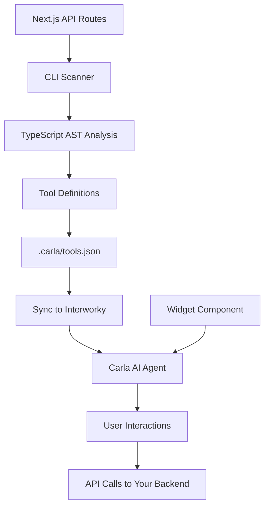

# How It Works

Learn how Carla Next.js transforms your API routes into AI-powered tools.

## Architecture Overview



## The Process

### 1. Route Scanning

The CLI scans your API directory using TypeScript's AST (Abstract Syntax Tree) parser:

```typescript
// Your API route: app/api/users/[id]/route.ts
export async function GET(
  request: Request,
  { params }: { params: { id: string } }
) {
  const user = await getUserById(params.id)
  return Response.json(user)
}
```

The scanner extracts:
- **HTTP Method**: `GET`
- **Route Path**: `/api/users/[id]`
- **Parameters**: `{ id: string }`
- **Response Type**: `User`

### 2. Tool Generation

Based on the scan results, the CLI generates a tool definition:

```json
{
  "name": "get_user",
  "description": "Get user by ID",
  "path": "/api/users/[id]",
  "method": "GET",
  "parameters": {
    "type": "object",
    "properties": {
      "id": {
        "type": "string",
        "description": "User ID"
      }
    },
    "required": ["id"]
  },
  "enabled": true
}
```

### 3. Synchronization

When you run `sync`, the tool definitions are uploaded to Interworky:

```bash
npx @interworky/carla-nextjs sync
```

This makes the tools available to Carla in the cloud.

### 4. Widget Integration

The widget component embeds Carla on your site:

```tsx
// Auto-generated component
'use client'

import { useEffect } from 'react'

export default function InterworkyWidget() {
  useEffect(() => {
    const timer = setTimeout(() => {
      const script = document.createElement('script')
      script.src = 'https://cdn.interworky.com/widget.js'
      script.async = true
      script.setAttribute('data-api-key', process.env.NEXT_PUBLIC_CARLA_API_KEY!)
      document.body.appendChild(script)
    }, 1500)

    return () => clearTimeout(timer)
  }, [])

  return null
}
```

### 5. Real-time Interaction

When a user interacts with Carla:

1. **User asks**: "Show me user #123"
2. **Carla analyzes** the request
3. **Carla selects tool**: `get_user`
4. **Carla calls API**: `GET /api/users/123`
5. **Your API responds** with user data
6. **Carla presents** the formatted response

## TypeScript AST Analysis

The scanner uses TypeScript's compiler API to understand your code:

### Extracting Parameters

```typescript
// Input code
export async function POST(request: Request) {
  const body = await request.json()
  const { name, email }: { name: string; email: string } = body
  // ...
}
```

```json
// Generated schema
{
  "parameters": {
    "type": "object",
    "properties": {
      "name": { "type": "string" },
      "email": { "type": "string" }
    },
    "required": ["name", "email"]
  }
}
```

### Extracting Response Types

```typescript
// Input code
interface User {
  id: string
  name: string
  email: string
}

export async function GET(): Promise<Response> {
  const user: User = await getUser()
  return Response.json(user)
}
```

```json
// Generated schema
{
  "response": {
    "type": "object",
    "properties": {
      "id": { "type": "string" },
      "name": { "type": "string" },
      "email": { "type": "string" }
    }
  }
}
```

## Configuration Storage

All tool data is stored locally in `.carla/`:

```
.carla/
├── tools.json       # Tool definitions
├── config.json      # User configuration
└── debug.json       # Debug information
```

### tools.json Structure

```json
{
  "tools": [
    {
      "name": "create_order",
      "description": "Create a new order",
      "path": "/api/orders",
      "method": "POST",
      "enabled": true,
      "parameters": { ... },
      "response": { ... }
    }
  ],
  "lastScan": "2024-01-15T10:30:00Z",
  "version": "1.0.0"
}
```

## Security

### API Key Protection

Your API key is stored in environment variables:

```bash
NEXT_PUBLIC_CARLA_API_KEY="your-key"
```

The `NEXT_PUBLIC_` prefix makes it available to the client-side widget but keeps it separate from server-side secrets.

### Tool Authorization

You control which tools Carla can access:

```json
{
  "name": "delete_user",
  "enabled": false  // Disabled for safety
}
```

### Request Validation

All API calls go through your existing validation:

```typescript
// Your existing middleware still applies
export async function POST(request: Request) {
  const auth = request.headers.get('authorization')
  if (!isValidAuth(auth)) {
    return Response.json({ error: 'Unauthorized' }, { status: 401 })
  }
  // ...
}
```

## Performance

### Widget Loading

The widget loads asynchronously with a 1.5s delay:

- Non-blocking: Won't slow down your page load
- Lazy-loaded: Only loads when needed
- Optimized: Minimal bundle size

### API Calls

Carla makes direct calls to your APIs:

- No proxy overhead
- Uses your existing infrastructure
- Respects your rate limits
- Cached responses when appropriate

## Deployment

### Development

```bash
npm run dev
```

Tools are automatically detected during development.

### Production

1. **Build your app**:
   ```bash
   npm run build
   ```

2. **Deploy to your platform** (Vercel, AWS, etc.)

3. **Tools are available** immediately via your API endpoints

### CI/CD Integration

Add to your deployment pipeline:

```yaml
# .github/workflows/deploy.yml
- name: Scan and sync tools
  run: |
    npx @interworky/carla-nextjs scan
    npx @interworky/carla-nextjs sync
  env:
    NEXT_PUBLIC_CARLA_API_KEY: ${{ secrets.CARLA_API_KEY }}
```

## Monitoring

Track tool usage in the Interworky dashboard:

- Call frequency
- Response times
- Error rates
- User feedback
- Popular queries

## Next Steps

- [Widget Customization](/guide/widget)
- [Tool Generation Details](/guide/tool-generation)
- [Configuration Options](/guide/configuration)
- [MCP Integration](/guide/mcp)
