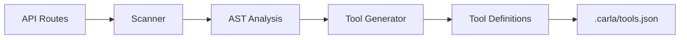

# Tool Generation

Learn how Carla Next.js automatically converts your API routes into AI-powered tools using TypeScript AST analysis.

## What is Tool Generation?

Tool generation is the process of analyzing your Next.js API routes and creating **tool definitions** that AI assistants can use. These tools follow the [OpenAI Function Calling](https://platform.openai.com/docs/guides/function-calling) specification, allowing Carla to:

- Understand what your API endpoints do
- Know what parameters they require
- Call them automatically based on user requests
- Present responses in a conversational format

## How It Works

The tool generation process has three main stages:



### 1. Route Discovery

The scanner looks for API routes in your project:

```
app/api/**/route.{ts,js,tsx,jsx}
src/app/api/**/route.{ts,js,tsx,jsx}
pages/api/**/*.{ts,js,tsx,jsx}
src/pages/api/**/*.{ts,js,tsx,jsx}
```

### 2. TypeScript AST Parsing

Each route file is parsed using TypeScript's compiler API to extract:
- HTTP methods (GET, POST, PUT, DELETE, PATCH)
- Path parameters from file structure
- Request body parameters from code
- Authentication patterns
- Response types

### 3. Tool Definition Creation

The generator creates structured tool definitions with:
- Descriptive names and instructions
- JSON Schema for parameters
- Security annotations
- Usage recommendations

## Tool Definition Structure

Each generated tool follows this structure:

```typescript
interface Tool {
  id: string              // Unique identifier
  name: string            // Tool name (e.g., "get_user")
  description: string     // Human-readable description
  instruction: string     // When AI should use this tool
  source: string          // Source file path
  enabled: boolean        // Whether tool is active
  method: string          // HTTP method
  endpoint: string        // API endpoint
  parameters: {           // JSON Schema
    type: "object"
    properties: Record<string, {
      type: string
      description: string
    }>
    required: string[]
  }
  auth?: string          // "required" if auth detected
  issues?: string[]      // Security/quality issues
}
```

## Naming Conventions

Tool names are generated from endpoints using smart conventions:

### Pattern Rules

| Endpoint | Method | Generated Name | Logic |
|----------|--------|---------------|-------|
| `/api/users` | GET | `get_users` | List operation |
| `/api/users/:id` | GET | `get_user` | Singular (by ID) |
| `/api/orders` | POST | `post_order` | Create (singular) |
| `/api/products/:id` | PUT | `put_product` | Update by ID |
| `/api/comments/:id` | DELETE | `delete_comment` | Delete by ID |

### Name Transformation Process

```typescript
// 1. Remove /api prefix
"/api/users/:id" → "users/:id"

// 2. Remove dynamic params
"users/:id" → "users"

// 3. Singularize for specific operations
"users" + GET/:id → "user"
"users" + POST → "user"

// 4. Add method prefix
"user" + GET → "get_user"
```

::: tip
The generator automatically handles:
- Pluralization/singularization
- Nested routes (`/api/users/:userId/posts` → `get_user_posts`)
- Special characters (replaced with underscores)
- Duplicate prevention
:::

## Parameter Extraction

### Path Parameters

Path parameters are extracted from the route file structure:

```typescript
// File: app/api/products/[id]/route.ts
export async function GET(
  request: Request,
  { params }: { params: { id: string } }
) {
  // ...
}
```

**Generated parameters:**
```json
{
  "parameters": {
    "type": "object",
    "properties": {
      "id": {
        "type": "string",
        "description": "The id parameter"
      }
    },
    "required": ["id"]
  }
}
```

### Body Parameters

For POST/PUT/PATCH requests, the generator analyzes request body parsing:

```typescript
// File: app/api/users/route.ts
export async function POST(request: Request) {
  const { name, email }: { name: string; email: string } =
    await request.json()

  // Create user...
}
```

**Generated parameters:**
```json
{
  "parameters": {
    "type": "object",
    "properties": {
      "name": {
        "type": "string",
        "description": "The name field"
      },
      "email": {
        "type": "string",
        "description": "The email field"
      }
    },
    "required": ["name", "email"]
  }
}
```

::: warning
Parameter extraction works best with TypeScript type annotations. Without types, the generator may not detect all parameters.
:::

### Multiple Path Parameters

Complex routes with multiple dynamic segments:

```typescript
// File: app/api/organizations/[orgId]/projects/[projectId]/route.ts
```

**Generated parameters:**
```json
{
  "parameters": {
    "type": "object",
    "properties": {
      "orgId": {
        "type": "string",
        "description": "The orgId parameter"
      },
      "projectId": {
        "type": "string",
        "description": "The projectId parameter"
      }
    },
    "required": ["orgId", "projectId"]
  }
}
```

## Descriptions & Instructions

### Automatic Descriptions

Descriptions are generated based on HTTP method and resource:

```typescript
// GET /api/users
"List all users"

// GET /api/users/:id
"Get user by ID"

// POST /api/orders
"Create a new order"

// PUT /api/products/:id
"Update product by ID"

// PATCH /api/settings/:id
"Partially update setting by ID"

// DELETE /api/comments/:id
"Delete comment by ID"
```

### AI Instructions

Instructions tell the AI assistant when to use each tool:

```typescript
// GET /api/products/:id
"Use this tool when the user asks about a specific product. Requires the ID."

// POST /api/orders
"Use this tool when the user wants to create or add a new order."

// DELETE /api/users/:id
"⚠️ Destructive operation. Only use when user explicitly requests deletion of a user."
```

## Authentication Detection

The generator scans for common authentication patterns:

### Detected Patterns

```typescript
// NextAuth.js
const session = await getServerSession(authOptions)

// Custom auth
const token = request.headers.get('Authorization')
await verifyToken(token)

// Middleware
await authenticate(request)
await checkAuth(request)
await requireAuth()

// Headers
const bearer = request.headers.get('Authorization')?.startsWith('Bearer')
```

### Auth Annotation

When auth is detected, the tool is marked accordingly:

```json
{
  "name": "create_order",
  "auth": "required",
  "issues": []
}
```

Without auth on mutation operations:

```json
{
  "name": "delete_user",
  "auth": undefined,
  "issues": ["no_authentication_detected"]
}
```

## Security Features

### Destructive Operations

DELETE operations are automatically disabled by default:

```json
{
  "name": "delete_product",
  "enabled": false,
  "issues": ["destructive_operation"]
}
```

::: danger
You must manually enable DELETE tools in `.carla/tools.json` after reviewing their safety.
:::

### Security Recommendations

The generator provides recommendations for security issues:

```typescript
{
  type: "security",
  message: "No authentication detected for POST operation: create_order",
  tool: "create_order",
  autoFixAvailable: false
}
```

Common security recommendations:
- Missing authentication on mutations
- Destructive operations (DELETE)
- Public endpoints that should be protected

## Examples

### Example 1: Simple GET Endpoint

**Input code:**
```typescript
// app/api/products/route.ts
export async function GET() {
  const products = await db.products.findMany()
  return Response.json(products)
}
```

**Generated tool:**
```json
{
  "id": "get_products",
  "name": "get_products",
  "description": "List all products",
  "instruction": "Use this tool when the user asks to see all products or list products.",
  "source": "app/api/products/route.ts",
  "enabled": true,
  "method": "GET",
  "endpoint": "/api/products",
  "parameters": {
    "type": "object",
    "properties": {},
    "required": []
  },
  "issues": []
}
```

### Example 2: POST with Body Parameters

**Input code:**
```typescript
// app/api/users/route.ts
export async function POST(request: Request) {
  const { name, email }: { name: string; email: string } =
    await request.json()

  const user = await db.users.create({
    data: { name, email }
  })

  return Response.json(user, { status: 201 })
}
```

**Generated tool:**
```json
{
  "id": "post_user",
  "name": "post_user",
  "description": "Create a new user",
  "instruction": "Use this tool when the user wants to create or add a new user.",
  "source": "app/api/users/route.ts",
  "enabled": true,
  "method": "POST",
  "endpoint": "/api/users",
  "parameters": {
    "type": "object",
    "properties": {
      "name": {
        "type": "string",
        "description": "The name field"
      },
      "email": {
        "type": "string",
        "description": "The email field"
      }
    },
    "required": ["name", "email"]
  },
  "issues": ["no_authentication_detected"]
}
```

### Example 3: Protected Dynamic Route

**Input code:**
```typescript
// app/api/orders/[id]/route.ts
import { getServerSession } from "next-auth"
import { authOptions } from "@/lib/auth"

export async function GET(
  request: Request,
  { params }: { params: { id: string } }
) {
  const session = await getServerSession(authOptions)

  if (!session) {
    return Response.json({ error: "Unauthorized" }, { status: 401 })
  }

  const order = await db.orders.findUnique({
    where: { id: params.id }
  })

  return Response.json(order)
}
```

**Generated tool:**
```json
{
  "id": "get_order",
  "name": "get_order",
  "description": "Get order by ID",
  "instruction": "Use this tool when the user asks about a specific order. Requires the ID.",
  "source": "app/api/orders/[id]/route.ts",
  "enabled": true,
  "method": "GET",
  "endpoint": "/api/orders/:id",
  "parameters": {
    "type": "object",
    "properties": {
      "id": {
        "type": "string",
        "description": "The id parameter"
      }
    },
    "required": ["id"]
  },
  "auth": "required",
  "issues": []
}
```

## Customizing Generated Tools

After scanning, you can manually enhance tool definitions in `.carla/tools.json`:

### Improving Descriptions

```json
{
  "name": "get_products",
  "description": "Get all products in the catalog with optional filtering",
  "instruction": "Use this tool when the user wants to browse products, search the catalog, or filter by category."
}
```

### Adding Documentation

```json
{
  "name": "create_order",
  "parameters": {
    "type": "object",
    "properties": {
      "items": {
        "type": "array",
        "description": "Array of product IDs and quantities"
      },
      "shippingAddress": {
        "type": "string",
        "description": "Complete shipping address including zip code"
      }
    },
    "required": ["items", "shippingAddress"]
  }
}
```

### Enabling/Disabling Tools

```json
{
  "name": "delete_user",
  "enabled": true  // Manually enable after review
}
```

```json
{
  "name": "internal_admin_tool",
  "enabled": false  // Disable internal-only endpoints
}
```

### Adding Fixed Parameters

For parameters that should always have the same value:

```json
{
  "name": "get_products",
  "fixed_params": [
    {
      "field_name": "limit",
      "field_value": 50
    }
  ]
}
```

## Configuration File

Generated tools are saved to `.carla/tools.json`:

```json
{
  "version": "1.0.0",
  "generatedAt": "2024-11-08T10:30:00.000Z",
  "tools": [
    {
      "id": "get_users",
      "name": "get_users",
      "description": "List all users",
      // ... more properties
    }
  ],
  "settings": {
    "mcpEndpoint": "/api/mcp"
  }
}
```

### Version Control

::: tip
Consider adding `.carla/` to `.gitignore` if tools contain sensitive endpoint information.

Or commit it to track tool definitions across your team.
:::

## Advanced Topics

### TypeScript AST Traversal

The scanner uses TypeScript's compiler API to analyze code:

```typescript
const sourceFile = ts.createSourceFile(
  filePath,
  source,
  ts.ScriptTarget.Latest,
  true
)

// Find function declarations
ts.forEachChild(sourceFile, (node) => {
  if (ts.isFunctionDeclaration(node)) {
    // Extract method info
  }
})
```

### Extending the Generator

You can fork and customize the generator for your needs:

```typescript
// src/cli/generator/tool-generator.ts
class CustomToolGenerator extends ToolGenerator {
  protected generateDescription(endpoint: string, method: string): string {
    // Your custom description logic
    return `Custom: ${method} ${endpoint}`
  }
}
```

## Best Practices

### 1. Use TypeScript

TypeScript provides better type inference for parameters:

```typescript
// ✅ Good - types are detected
const { name, email }: { name: string; email: string } =
  await request.json()

// ❌ Bad - types not detected
const data = await request.json()
const name = data.name
```

### 2. Add JSDoc Comments

JSDoc comments can improve generated descriptions:

```typescript
/**
 * Get user profile by ID
 * @param id - User's unique identifier
 */
export async function GET(
  request: Request,
  { params }: { params: { id: string } }
) {
  // ...
}
```

### 3. Use Descriptive Route Names

Clear route structure helps with naming:

```typescript
// ✅ Good
app/api/users/route.ts
app/api/users/[id]/route.ts

// ❌ Unclear
app/api/u/route.ts
app/api/fetch/route.ts
```

### 4. Implement Authentication

Always protect mutation operations:

```typescript
// ✅ Good
export async function POST(request: Request) {
  const session = await getServerSession(authOptions)
  if (!session) return Response.json({ error: "Unauthorized" }, { status: 401 })

  // ... create resource
}
```

### 5. Review Generated Tools

Always review and customize `.carla/tools.json`:

```bash
# Scan routes
npx @interworky/carla-nextjs scan

# Review the output
cat .carla/tools.json

# Edit descriptions and instructions
# Enable/disable tools as needed

# Sync when ready
npx @interworky/carla-nextjs sync
```

## Troubleshooting

### No Tools Generated

**Problem:** Scanner finds no API routes

**Solutions:**
- Verify routes exist in `app/api/` or `pages/api/`
- Check file naming: `route.ts` (App Router) or `*.ts` (Pages Router)
- Run with `--force` flag
- Check for TypeScript errors in route files

### Missing Parameters

**Problem:** Parameters not detected in generated tools

**Solutions:**
- Add TypeScript type annotations
- Use explicit destructuring
- Check for parsing errors in route files

### Wrong Tool Names

**Problem:** Generated names don't match expectations

**Solutions:**
- Manually edit tool names in `.carla/tools.json`
- Restructure route file paths for better naming
- Consider nested routes structure

### Auth Not Detected

**Problem:** Auth is implemented but not detected

**Solutions:**
- Use common patterns: `getServerSession`, `verifyToken`, etc.
- Add `auth: "required"` manually in `.carla/tools.json`
- Ensure auth code is in the same file as the route handler

## Next Steps

Now that you understand tool generation:

- **[API Scanning](/guide/api-scanning)** - Deep dive into route scanning
- **[Configuration](/guide/configuration)** - Customize tool settings
- **[Sync Tools](/reference/cli#sync)** - Push tools to Interworky
- **[MCP Integration](/guide/mcp)** - Use tools with AI assistants
